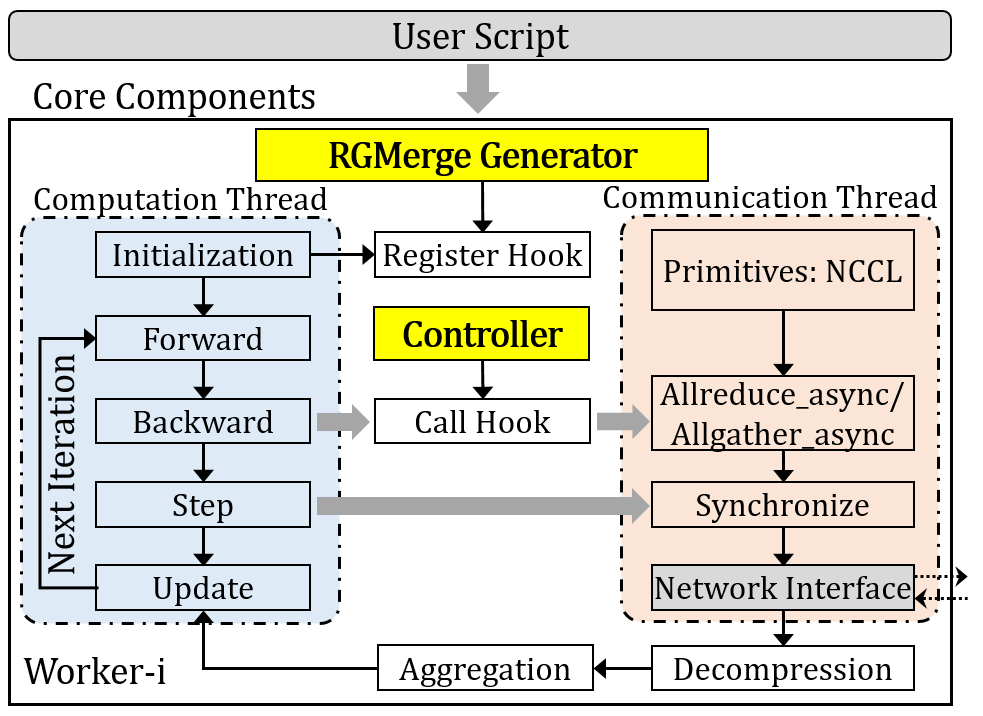

# FGbuff

__FGBuff__ is a fine-grained buffering scheme for merged gradient sparsification. We design a quantity-based inter-worker buffering method, which allows different workers to merge the same amount of sparsified gradients into buffers, so as to avoid the buffer synchronization waiting across workers. Meanwhile we also design an adaptive intra-worker buffering method, which maximizes the overlap of merging and communications, so as to speed up the pipeline within each worker. This repository contains __FGBuff__’s source code, as well as a set of benchmarking scripts for some popular open source data-parallel distributed DNN training framework with state-of-the-art gradient merging schemes.

# Introduction

This code repository covers:

### FGBuff

- __FGBuff__ with a quantity-based inter-worker buffering method to control the consistency of the gradient type and number buffered by inter-worker during each gradient merging.
- An adaptive intra-worker buffering method that maximizes the overlap of computations and communications.

### State-of-the-art gradient merging schemes.

- [Horovod](https://github.com/horovod/horovod)
- [SyncEA](https://dl.acm.org/doi/pdf/10.1145/3126908.3126912)
- [OMGS](https://github.com/HKBU-HPML/OMGS-SGD)
- [DeAR](https://github.com/lzhangbv/dear_pytorch?tab=readme-ov-file)

# Implementation

We use the PyTorch framework and implemented the prototype system of __FGBuff__ based on the [Horovod](https://github.com/horovod/horovod) framework using NCCL as the communication library. Overview of our system is as follows.



# Installation

## **Prerequisites**

- CUDA-11.6
- NCCL-2.8.3
- PyTorch-1.3.+
- [OpenMPI-4.0.+](https://www-lb.open-mpi.org/software/ompi/v4.0/)
- [Horovod-0.27.+](https://github.com/horovod/horovod)

## Get the code

```
git clone https://github.com/ATC24-FGBuff/FGBuff.git
cd FGBuff
pip install -r requirements.txt
HOROVOD_GPU_OPERATIONS=NCCL pip install horovod==0.21.3
```

if pip installation failed, please try to upgrade pip via `pip install --upgrade pip`. If [Horovod](https://github.com/horovod/horovod) installation with NCCL failed, please check the installation [guide](https://horovod.readthedocs.io/en/stable/install_include.html).

## Quick start

To run CV jobs:

```
cd example/cv/
bash run_cifar100_resnet50.sh
```

To run NLP jobs:

```
cd example/nlp/bert/scripts
bash run_squad_bert.sh
```

## Papers

FGBuff: Fine-Grained Buffering for Efficient Merged Gradient Sparsification in Data-Parallel Distributed DNN Training Systems

## Referred Datasets

- CIFAR-100: [https://www.cs.utoronto.ca/~kriz/cifar.html](https://www.cs.utoronto.ca/~kriz/cifar.html)
- ImageNet: [https://www.image-net.org/](https://www.image-net.org/)
- Wikitex-2/103: [https://huggingface.co/datasets/wikitext](https://huggingface.co/datasets/wikitext)
- SQuAD: [https://rajpurkar.github.io/SQuAD-explorer/](https://rajpurkar.github.io/SQuAD-explorer/)

## License

See [LICENSE](https://github.com/ATC24-FGBuff/FGBuff/blob/main/LICENSE.txt).