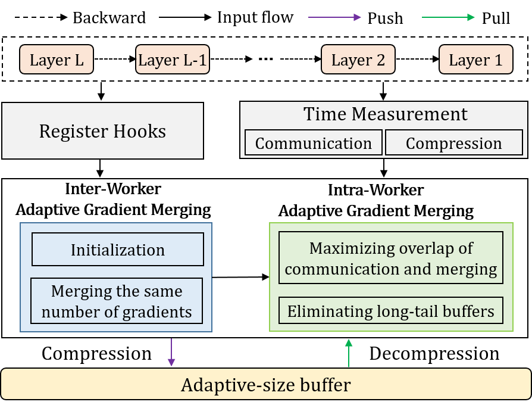

# AGMerge

__AGMerge__ is a new adaptive gradient merging mechanism for boosting sparse communication. We first design an inter-worker adaptive gradient merging method, which allows all workers’ buffer sizes of the same merge phase to be adapted to satisfy that each worker merges the same amount of sparsified gradients before every synchronization, thus avoiding the synchronization waits across workers. We also design an intra-worker adaptive gradient merging method, which allows each worker’s buffer size of all merge phases to be adapted to overlap merging and communication as far as possible, thus reducing the communication waiting periods within every worker. This repository contains __AGMerge__’s source code, as well as a set of benchmarking scripts for some popular open-source distributed DNN training systems with state-of-the-art gradient merging schemes.

# Introduction
This code repository covers:
### __AGMerge__
- AGM-Inter: Inter-worker adaptive gradient merging scheme
- AGM-(Inter+Intra): Intra-worker adaptive gradient merging scheme

### State-of-the-art gradient merging schemes.

- [Horovod](https://github.com/horovod/horovod)
- [SyncEA](https://dl.acm.org/doi/pdf/10.1145/3126908.3126912)
- [OMGS](https://github.com/HKBU-HPML/OMGS-SGD)
- [DeAR](https://github.com/lzhangbv/dear_pytorch?tab=readme-ov-file)

### State-of-the-art sparsification algorithms.

- [DGC](https://arxiv.org/pdf/1712.01887.pdf)
- [Gaussiank](https://arxiv.org/pdf/1911.08772.pdf)
- [Redsync](https://www.sciencedirect.com/science/article/pii/S0743731518308657)
- [SIDCo](https://proceedings.mlsys.org/paper_files/paper/2021/file/fea47a8aa372e42f3c84327aec9506cf-Paper.pdf)

# Implementation


## **__AGMerge__** System Architecture
We use the PyTorch framework and implemented the prototype system of __AGMerge__ based on the [Horovod](https://github.com/horovod/horovod) framework using NCCL as the communication library. The overview of our system is as follows: 
<!--  -->
<center class ='img'>

</center>

## **__AGMerge__** Generator
The workflow of the __AGMerge__ generator module：
<center class ='img'>

</center>

# Installation


## **Prerequisites**
- CUDA-12.0
- NCCL-2.8.3
- PyTorch-1.3.+
- [OpenMPI-4.0.+](https://www-lb.open-mpi.org/software/ompi/v4.0/)
- [Horovod-0.28.1+](https://github.com/horovod/horovod)


## **Get the code**
```
git clone https://github.com/INFOCOM2025-AGMerge/AGMerge.git
cd AGMerge
pip install -r requirements.txt
HOROVOD_GPU_OPERATIONS=NCCL pip install horovod==0.28.0
```

if pip installation fails, please try to upgrade pip via `pip install --upgrade pip`. If [Horovod](https://github.com/horovod/horovod) installation with NCCL failed, please check the installation [guide](https://horovod.readthedocs.io/en/stable/install_include.html).

## **Quick start**

To run ResNet-152 training job:

```
cd example/cv
bash run_imagenet_resnet152.sh
```

To run BERT-large training job:
```
cd example/nlp/bert/scripts
bash run_squad_bert.sh
```

To run GPT2-large training job:
```
cd example/nlp/gpt
bash run_clm_no_trainer_hvd_103.sh
```

## **Papers**

AGMerge: Adaptive Gradient Merging for Boosting Sparse Communication in Distributed Training Systems

## **Referred Datasets**

- CIFAR-100: [https://www.cs.utoronto.ca/~kriz/cifar.html](https://www.cs.utoronto.ca/~kriz/cifar.html)
- ImageNet: [https://www.image-net.org/](https://www.image-net.org/)
- Wikitex-2/103: [https://huggingface.co/datasets/wikitext](https://huggingface.co/datasets/wikitext)
- SQuAD: [https://rajpurkar.github.io/SQuAD-explorer/](https://rajpurkar.github.io/SQuAD-explorer/)

## **License**

See [LICENSE](https://github.com/ATC24-AGMerge/AGMerge/blob/main/LICENSE.txt).
